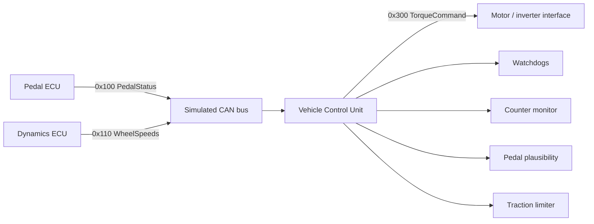

# Architecture

## Design goals

The project separates **vehicle-control logic** from **CAN transport**. `VehicleController` consumes and produces plain `CanFrame` values; the simulator supplies those frames through an in-process bus. This keeps the control code testable without Linux SocketCAN or physical CAN hardware.

## Message flow



### `0x100 PedalStatus`

- accelerator position: 0.1 %/bit
- brake position: 0.1 %/bit
- four-bit rolling counter

The VCU checks that consecutive counter values increment modulo 16. A discontinuity latches a controller fault until `reset_faults()` is called.

### `0x110 WheelSpeeds`

- front-left, front-right, rear-left, rear-right wheel speed
- 0.1 km/h per bit

The simulator treats the front axle as the vehicle-speed reference and the rear axle as the driven axle.

### `0x300 TorqueCommand`

- signed requested motor torque in Nm
- controller state (`READY`, `DERATE`, `FAULT`)
- estimated driven-wheel slip ratio

## Control pipeline

Every controller update performs the following sequence:

1. **Input watchdogs** verify that pedal and wheel-speed messages are no more than 100 ms old.
2. **Latched integrity faults** check the pedal rolling counter and accelerator/brake plausibility.
3. **Brake override** commands zero positive drive torque whenever brake position exceeds 2%.
4. **Driver torque request** scales accelerator position to a configurable maximum torque (320 Nm by default).
5. **Slip estimation** compares average rear-wheel speed with average front-wheel speed.
6. **Traction derating** begins at 8% slip and linearly reduces torque to zero at 25% slip.

The slip calculation is:

```text
slip = (rear_average_kph - front_average_kph) / max(front_average_kph, 5 kph)
```

The 5 km/h denominator floor prevents the ratio from becoming numerically extreme near standstill. A production controller would normally use a more sophisticated vehicle-speed estimator and low-speed strategy.

## State behavior

| State | Meaning | Torque behavior |
|---|---|---|
| `READY` | Inputs valid and no traction intervention | Driver request, or zero during braking |
| `DERATE` | Excessive driven-wheel slip | Progressively reduced |
| `FAULT` | Timeout, counter error, or pedal conflict | Forced to zero |

`FAULT` is intentionally conservative. Counter and pedal-plausibility faults are latched; timeout faults recover when fresh messages return.

## Test strategy

`tests/test_controller.cpp` validates the controller deterministically without launching the full simulator. It covers:

- nominal torque generation
- slip-based derating
- simultaneous accelerator/brake fault handling
- input timeout and recovery
- repeated rolling-counter fault handling
- signal serialization/deserialization

`tools/fault_injection.py` runs the complete simulator as a subprocess and validates state transitions across scripted scenarios. This gives the project both unit-level checks and end-to-end behavior checks.

## Scope

This project demonstrates controls-software architecture and CAN-style signal handling. It is **not** a production automotive ECU and does not claim compliance with ISO 26262, AUTOSAR, or any OEM safety process. The default bus is simulated rather than a physical CAN interface.
